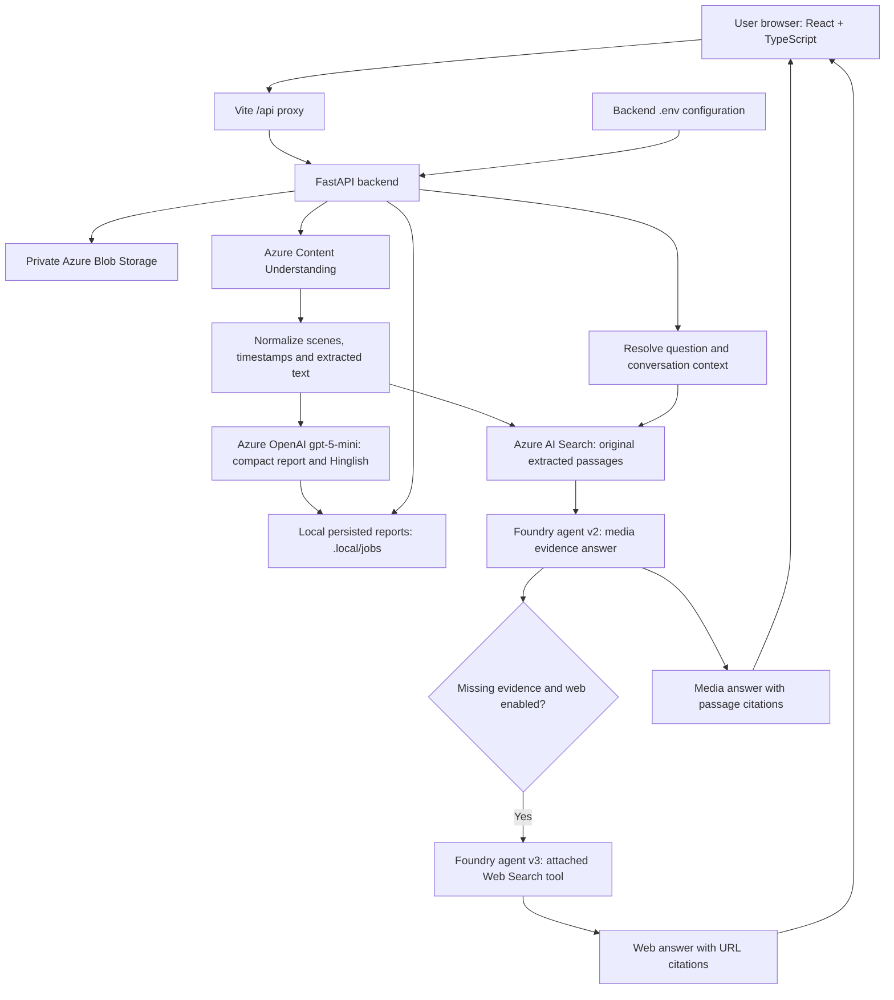

# Smart Media Analysis Agent

An Azure-powered media analysis project for AI-103. Upload a video or image, or provide a supported public video link, to produce a concise report and ask questions with evidence citations.

## API-key migration branch

API-key mode is now active on the development laptop. Live checks passed for Storage upload/read/delete, AI Search access, generated-image extraction, report formatting, question resolution, cited model answers and web search. These checks do not establish that every video format will analyze successfully.

This branch adds `AZURE_AUTH_MODE=api-key`. Set these private backend/.env values:

```dotenv
AZURE_AUTH_MODE=api-key
AZURE_STORAGE_CONNECTION_STRING=
CONTENT_UNDERSTANDING_KEY=
REPORT_MODEL_KEY=
AZURE_SEARCH_KEY=
```

Keep the existing endpoints, container, index and model deployment settings.
Key mode uses direct Azure OpenAI for media answers and its Responses API Web Search
for external answers; it does not call saved Foundry agents. No tenant/client IDs
or Azure CLI login are used at runtime in this mode. Azure resource settings must
allow key authentication, and firewall rules still apply. Network access, quotas,
and secret validity can differ on another laptop.

Rollback: the `foundry-before-api-keys` Git tag preserves the Foundry implementation.
The private original `.env` is backed up locally under
`.local/backups/foundry-before-api-keys/backend.env` (not on GitHub).
Restore that code and private configuration to return to the previous setup.

## Current status

The React frontend and FastAPI backend run locally. Analysis, storage, retrieval, model calls and optional web search use Azure online services. This is not an offline AI model and is not yet a publicly hosted website.

Implemented: real media analysis, compact summaries, main topics, timestamped video moments, Romanized Hindi (Hinglish) transcript presentation, original extracted passages, report search, saved local reports, follow-up questions and optional cited web answers. Prepared samples are separate demonstrations.

## Architecture



The same saved Foundry agent, `smart-media-analysis-agent`, has version 2 for media-only answers and version 3 with Web Search attached. Version numbers are configuration values, specific to this project's Azure setup. Azure AI Search is called by the backend with a filter for the selected report; it is not an attached tool on version 2.

## Project pipeline

1. Validate an uploaded image/video or download a supported public video link. Reject unsupported types, oversized files and private-network link targets.
2. Save uploaded bytes in private Azure Blob Storage.
3. Submit bytes to Azure Content Understanding and poll the asynchronous analysis.
4. Normalize the extracted content into scenes, timestamps, descriptions and passages.
5. Use Azure OpenAI to prepare a concise summary, topics and readable Hinglish transcript. Preserve the original extraction separately. If formatting fails, expose a retry rather than silently discarding the extraction.
6. Index original extracted passages in Azure AI Search. Generated scene descriptions can still be present in the extraction; they are not guaranteed verbatim speech.
7. Save the completed report locally, then display it in the browser.
8. For a question, resolve the subject using recent conversation and matching passages, retrieve evidence from the selected report, and ask the media agent for a cited answer.
9. If evidence is insufficient and the user enables web search, call saved agent version 3. Display external URLs separately from video citations. Web research receives the resolved question, not the whole transcript.

## Technology and files

| Component | Implementation |
|---|---|
| Frontend | React, TypeScript, Vite, Lucide icons |
| Backend | Python, FastAPI, HTTPX, Pillow |
| Storage | Azure Blob Storage |
| Extraction | Azure Content Understanding prebuilt image/video search analyzers |
| Report generation | Azure OpenAI deployment `gpt-5-mini` |
| Retrieval | Azure AI Search keyword index `media-passages-v1` |
| Answers | Microsoft Foundry saved agent versions |
| Link handling | Bounded HTTPS downloads and yt-dlp |
| Configuration | python-dotenv and Azure Identity |
| Verification | pytest, TypeScript and Playwright |

```text
backend/
  .env.example             Shareable configuration template (no secrets)
  config.py                Load backend/.env without overriding process settings
  auth.py                  CLI, service principal or managed identity selection
  main.py                  API routes and background processing
  storage.py               Private Blob uploads
  content_understanding.py Azure extraction and polling
  report_editor.py         Compact report and transcript formatting
  search_store.py          Indexing and report-scoped retrieval
  foundry_agent.py          Media answers and citation validation
  web_answers.py           Question resolution and saved web-agent fallback
  link_media.py            Public video URL handling
  job_store.py             Local report persistence
frontend/src/
  App.tsx                  Upload, processing and navigation
  RealReport.tsx           Real report and transcript display
  RealChat.tsx             Follow-up questions and source display
  ReportLibrary.tsx         Saved report library
start-azure-storage.ps1     Windows backend launcher
RUNNING.md                 Day-to-day startup guide
.local/jobs/               Local completed/failed job records (ignored by Git)
```

## Run on a laptop

Prerequisites: Python 3.12+, Node.js 20.19+ or 22.12+, access to the configured Azure resources, and internet connectivity. CLI authentication also needs Azure CLI.

From the project root in PowerShell:

```powershell
python -m venv .venv
.\.venv\Scripts\python.exe -m pip install -r backend/requirements-lock.txt
# Only copy if backend/.env does not already exist:
Copy-Item backend/.env.example backend/.env
Set-Location frontend
npm.cmd ci
Set-Location ..
```

First terminal:

```powershell
# Required for AZURE_AUTH_MODE=cli only:
az login
.\start-azure-storage.ps1
```

Second terminal:

```powershell
Set-Location frontend
npm.cmd run dev -- --port 5173
```

Open http://127.0.0.1:5173. API documentation: http://127.0.0.1:8000/docs.
Keep both terminals running. The backend can also start with:

```powershell
.\.venv\Scripts\python.exe -m uvicorn backend.main:app --host 127.0.0.1 --port 8000
```

## Backend environment and portable authentication

`backend/.env` holds endpoints and authentication configuration. It is ignored by Git and never sent to the frontend. Restart the backend after editing it. Existing process environment variables override file values.

| Setting | Purpose |
|---|---|
| `PROCESSING_MODE=azure-media` | Real Azure image/video analysis |
| `STORAGE_MODE=azure` | Private Blob storage |
| `AZURE_STORAGE_ACCOUNT_URL`, `AZURE_STORAGE_CONTAINER` | Storage destination |
| `CONTENT_UNDERSTANDING_ENDPOINT` | Extraction service |
| `AZURE_SEARCH_ENDPOINT`, `AZURE_SEARCH_INDEX` | Report passage retrieval |
| `REPORT_MODEL_ENDPOINT`, `REPORT_MODEL_DEPLOYMENT` | Report generation and question resolution |
| `FOUNDRY_PROJECT_ENDPOINT`, `FOUNDRY_AGENT_NAME` | Saved agent location |
| `FOUNDRY_AGENT_VERSION` | Media-only agent version |
| `FOUNDRY_WEB_AGENT_VERSION` | Web-enabled agent version |
| `AZURE_AUTH_MODE` | `cli`, `service-principal`, or `managed-identity` |

### Existing local login

```dotenv
AZURE_AUTH_MODE=cli
```

Uses `az login`. This remains the active, previously verified setup on the current laptop.

### Run without a personal CLI login

All Azure integrations now support a service principal configured in `.env`:

```dotenv
AZURE_AUTH_MODE=service-principal
AZURE_TENANT_ID=your-directory-tenant-id
AZURE_CLIENT_ID=your-application-client-id
AZURE_CLIENT_SECRET=your-client-secret-value
```

This mode is implemented but cannot be activated or live-verified until a real application identity and its permissions are configured. The current `.env` intentionally stays in CLI mode with these fields empty. An invalid service-principal configuration fails clearly; it does not silently use someone's personal login.

Azure setup for an authorized tenant administrator or project owner:

1. Create a Microsoft Entra app registration in the tenant containing the resources. A new External ID tenant is not required for this backend identity.
2. Record its Directory (tenant) ID and Application (client) ID. Create a client secret and place its **value**, not secret ID, directly in the private backend `.env`.
3. Assign resource-scoped access: Storage Blob Data Contributor for the upload container/account; Search Index Data Contributor for indexing and querying; Search Service Contributor for this app's index inspection/creation; appropriate Foundry User (formerly Azure AI User) and Cognitive Services/OpenAI inference roles on the project/resource. Have the administrator verify the exact role scopes for the deployed services.
4. Ensure each laptop or hosted backend is allowed by the resource network rules. Credentials do not bypass a firewall.
5. Set `AZURE_AUTH_MODE=service-principal`, restart, and verify a real upload, report, search, media answer and web answer. `/api/health` reports configuration and a startup Blob access check; it is not a full end-to-end service test.

Use individual developer identities for teammates where possible. Never publish `.env`, put credentials in `VITE_*` settings, or share credentials with website visitors. Rotate any exposed secret. This identity authenticates the backend to Azure; it does not provide user login to the website.

For hosting on Azure, `AZURE_AUTH_MODE=managed-identity` is supported. Enable an identity on the hosting resource and assign the same required permissions. Leave `AZURE_CLIENT_ID` empty for system-assigned identity or set it for user-assigned identity. No client secret is needed.

References: [Microsoft service-principal setup](https://learn.microsoft.com/azure/developer/python/sdk/authentication-local-development-service-principal), [Foundry access roles](https://learn.microsoft.com/en-us/azure/foundry/concepts/rbac-foundry), [Foundry Web Search](https://learn.microsoft.com/en-us/azure/foundry/agents/how-to/tools/web-search).

## Sharing and deployment

A configured copy can run on another laptop. `127.0.0.1` always means the computer opening that address; `.env` does not create a public website. Other laptops need dependencies, authorized credentials and permitted network access.

To give the team and teacher one shared link, deploy the frontend/backend, configure production routing and HTTPS, add user access control, and move job persistence to shared durable storage. The current library is local and shared between anyone using that backend. There is no per-user ownership or production login yet. Do not describe it as a public multi-user deployment.

## Capabilities and limits

- Upload limit: 100 MB per file; images additionally limited to 25 megapixels.
- Formats: PNG, JPEG, WebP; MP4, MOV, WebM. Container validation does not guarantee the video can be decoded by Azure.
- Links: supported public YouTube videos and direct HTTPS video files. Not arbitrary websites, private/login-protected videos, DRM content or every YouTube format. Some videos lack a usable combined audio/video download within the limit.
- Processing can take several minutes depending on video size, service load and report formatting. The UI reports phases and elapsed processing timings.
- Keyword retrieval can miss paraphrases; transcripts and product names can contain recognition errors. Citations help users inspect the evidence but do not guarantee every generated claim is correct.
- Web answers require opt-in, use the attached Foundry Web Search tool, and may add Azure charges. Prices and specifications should be checked against the linked sources.
- Completed and failed jobs persist locally. Active work is not guaranteed to resume after a backend restart. Uploaded blobs remain until explicitly removed.
- Prepared samples do not analyze the selected file. Offline fixture mode is only a demonstration.

## Troubleshooting

| Symptom | Check |
|---|---|
| Azure/Blob not connected | Backend running, configured identity permissions, current public IP allowed by Storage firewall; restart after a network fix |
| MFA or expired login | In CLI mode run `az login`; service-principal mode needs a valid unexpired secret and roles |
| Missing service-principal fields | Fill the three private `.env` fields or switch back to `cli` |
| Report taking time | Inspect processing phase; avoid repeatedly uploading the same file |
| Compact formatting failed | Use the report's formatting retry; original extraction is retained |
| Job not found | Open an existing saved report from the library; check `.local/jobs` on the backend computer |
| No media answer | Inspect retrieved passages and exact product name; enable web search for related external facts |
| Foundry tool not visible | Open saved agent version 3; version 2 is intentionally media-only |

## Verification

```powershell
.\.venv\Scripts\python.exe -m pytest backend -q
Set-Location frontend
npm.cmd run build
npx.cmd playwright test tests/chat-scroll.spec.ts
```

Live tests may require Azure permissions and incur service usage. Unit tests do not load the developer `.env`. New service-principal and managed-identity modes require live verification with provisioned identities before deployment.

## Remaining production work

Public Azure hosting, user login and report ownership, shared durable job storage, background job recovery, monitoring, retention/deletion controls, and broader retrieval-quality evaluation. No custom model training has been performed; the project uses pretrained Azure models with retrieval and instructions.
